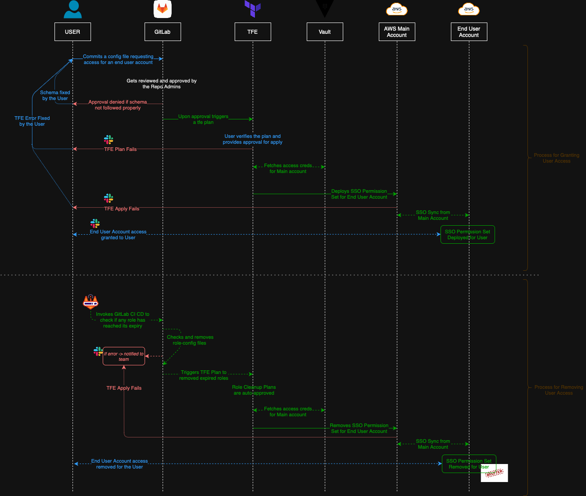

---

## 🔄 Execution Flow

### 🔐 Granting Access

1. **Create a `config.yaml` file**

   * Refer to sample config in this repository.
2. **Submit a Merge Request (MR)**

   * Add the file to the appropriate directory.
   * Optionally include `inline_policy.json` for custom permissions.
3. **TFE Workflow**

   * GitLab triggers a Terraform run via TFE.
   * TFE authenticates to AWS using dynamic Vault credentials.
   * A permission set is deployed and assigned directly to the user.
4. **Access Becomes Live**

   * The user sees the permission in their AWS SSO console shortly after.

---

### ♻️ Revoking Access

1. Every config file **must specify** an `end_date` and `end_time`.
2. A **daily GitLab pipeline** checks for expired configs.
3. Expired configs are either:

   * Deleted
   * Moved to `expired-roles/` for audit
4. A new TFE run is triggered automatically.
5. Terraform identifies removed roles and **plans to delete** them.
6. The cleanup run is **auto-approved**, and access is revoked.

---

## 🖼️ Workflow Diagram

> *Refer to the diagram for visual workflow (grant + revoke flows).*

---
